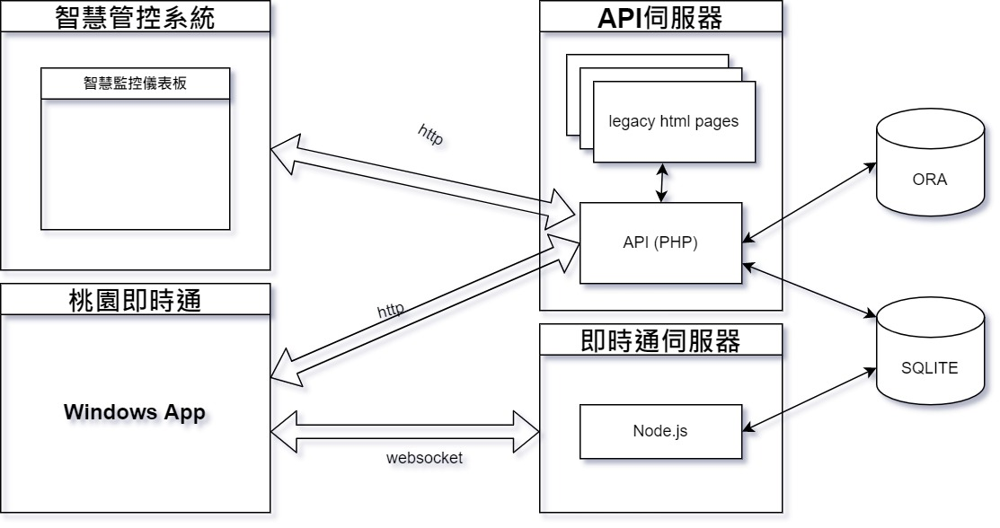

# Land Administration Hub Frontend by Nuxt.js v2

This frontend application relies on the LAH-API service, which functions as the PHP backend provider for all JSON data structures.

​Configuration:
> Please ensure all mandatory environment variables are defined prior to starting the Nuxt.js server. A template is provided in the .env.example file.



# Need to use Node.js in v16

# LAH-FE - Land Administration Hub FrontEnd 地政資訊管理前端

## 專案簡介

`LAH-FE` (Land Administration Hub - Frontend) 是一個基於 Nuxt.js v2 和 Vue.js 2 開發的前端應用程式，旨在為地政業務提供一個功能全面的內部智慧管控平台。系統整合了案件管理、系統監控、數據統計及使用者權限等多項核心功能。

本專案建立於 2017 年左右，採用了當時主流的技術棧與開發模式，並持續進行維護與功能迭代。

## 主要技術 (Core Technologies)

* **主要框架**: Nuxt.js (`~2.15.8`)
* **JS 框架**: Vue.js (`2.6.14`)
* **UI 框架**: BootstrapVue (`~2.21.2`)
* **樣板引擎**: Pug (`~3.0.2`)
* **HTTP 客戶端**: @nuxtjs/axios (`~5.13.6`)
* **JS 工具庫**: Lodash (`~4.17.21`)
* **CSS 預處理器**: SASS/SCSS (`~1.32.13`)
* **圖示庫**: Font Awesome (`~5.15.4`)
* **程序管理**: PM2 (`^5.1.0`)

## 專案結構

專案遵循標準的 Nuxt.js 目錄結構，核心目錄功能如下：

* **`/assets`**: 存放 SCSS 樣式、圖片、字體等未經編譯的靜態資源。
* **`/components`**: 存放可重用的 Vue 組件，是構成頁面的基本單位。
* **`/layouts`**: 存放應用程式的佈局，定義了共用的頁首、頁尾和側邊欄。
* **`/mixins`**: 存放可複用的 Vue Mixin 邏輯，例如動態高度計算、共用資料獲取等。
* **`/pages`**: 存放頁面級組件，此處的目錄結構會自動生成應用的路由。
* **`/plugins`**: 存放需要注入到 Vue 根實例的插件，例如 axios 的攔截器、全域 mixin 等。
* **`/store`**: 存放 Vuex 狀態管理檔案，按業務模組進行劃分。
* **`/constants`**: 存放專案中使用的常數，例如表格欄位定義、狀態碼等。

## 如何啟動 (Getting Started)

1.  **安裝依賴**
    ```bash
    yarn install
    ```

2.  **啟動開發環境**
    ```bash
    yarn dev
    ```
    應用程式將會在 `http://localhost:8080` 上運行。

3.  **打包部署**
    ```bash
    yarn build
    ```

## 主要功能模組

* **登記課 (智慧控管)**: 處理各類登記案件，如案件查詢、狀態追蹤、補正管理等。
* **測量課 (測量小幫手)**: 處理測量相關的業務邏輯。
* **資訊課 (智慧監控)**: 提供系統監控儀表板，如 PowerHA 狀態、伺服器連線、資料庫備份等。
* **地價課 (地價小幫手)**: 處理地價相關的業務。
* **系管 (Administration)**: 提供使用者管理、權限設定等後台功能。

